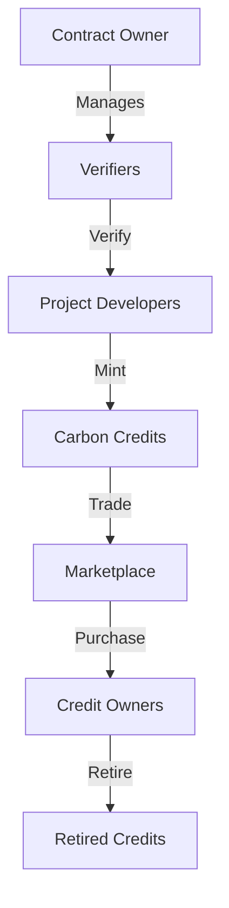

# CarbonMint: Decentralized Carbon Credit Marketplace

A transparent and verifiable marketplace for carbon credits on the Stacks blockchain. CarbonMint enables verified project developers to mint carbon credits representing real-world carbon offsets, while allowing individuals and organizations to purchase, trade, and retire these credits to offset their carbon footprint.

## Overview

CarbonMint brings carbon credits on-chain through a comprehensive smart contract system that:
- Validates and mints carbon credits from verified project developers
- Creates a transparent marketplace for trading carbon credits
- Enables permanent retirement of credits for carbon offsetting
- Maintains an immutable record of all transactions and offset claims

### Key Features
- Verified project developer registration
- Carbon credit minting with detailed metadata
- Peer-to-peer credit trading
- Transparent marketplace listings
- Permanent credit retirement mechanism
- Comprehensive tracking of market statistics

## Architecture

The system is built around a primary smart contract that manages the entire lifecycle of carbon credits, from minting to retirement.



### Core Components
1. **Governance System**: Contract owner manages authorized verifiers
2. **Verification Layer**: Authorized verifiers approve project developers
3. **Credit Registry**: Tracks all carbon credits and their current state
4. **Marketplace**: Enables listing and trading of credits
5. **Retirement Mechanism**: Permanently records offset claims

## Contract Documentation

### Core Functionality

#### Access Control
- `contract-owner`: Administrator with authority to manage verifiers
- `authorized-verifiers`: Approved entities that can verify project developers
- `verified-project-developers`: Registered developers who can mint credits

#### Carbon Credits
Each credit contains:
- Project developer information
- Amount in metric tons of CO2e
- Project details (type, location, standard)
- Vintage year and serial number
- Retirement status and beneficiary

#### Marketplace
Supports:
- Credit listings with customizable pricing
- Direct peer-to-peer transfers
- Purchase functionality
- Listing management

## Getting Started

### Prerequisites
- Clarinet
- Stacks wallet
- Test STX tokens (for testnet)

### Basic Usage

1. **Minting Credits** (Project Developers)
```clarity
(contract-call? .carbon-credit mint-carbon-credits
    u100 ; amount
    "Reforestation" ; project-type
    "Brazil" ; location
    "Verra" ; verification-standard
    u2023 ; vintage-year
    "VCS-123-456" ; serial-number
)
```

2. **Listing Credits**
```clarity
(contract-call? .carbon-credit list-credits-for-sale
    u1 ; credit-id
    u50 ; amount
    u1000000 ; price-per-ton (in microSTX)
)
```

3. **Buying Credits**
```clarity
(contract-call? .carbon-credit buy-carbon-credits u1) ; listing-id
```

4. **Retiring Credits**
```clarity
(contract-call? .carbon-credit retire-carbon-credits 
    u1 ; credit-id
    u10 ; amount
    none ; beneficiary (optional)
)
```

## Function Reference

### Administrative Functions
- `transfer-ownership(new-owner)`
- `add-verifier(verifier)`
- `remove-verifier(verifier)`

### Project Developer Functions
- `register-project-developer(developer, project-name)`
- `revoke-project-developer(developer)`

### Credit Management
- `mint-carbon-credits(amount, project-type, location, standard, year, serial)`
- `transfer-carbon-credits(recipient, credit-id, amount)`
- `retire-carbon-credits(credit-id, amount, beneficiary)`

### Marketplace Functions
- `list-credits-for-sale(credit-id, amount, price-per-ton)`
- `cancel-listing(listing-id)`
- `buy-carbon-credits(listing-id)`

## Development

### Testing
Run the test suite using Clarinet:
```bash
clarinet test
```

### Local Development
1. Clone the repository
2. Install dependencies with `clarinet requirements`
3. Start local development chain with `clarinet start`

## Security Considerations

### Key Safeguards
- Multi-level authorization system
- Verification requirements for project developers
- Balance checks for transfers
- Prevention of double-counting through retirement mechanism

### Limitations
- Relies on off-chain verification of carbon credits
- Price denominated in microSTX only
- No partial listing fulfillment
- Simple retirement tracking model